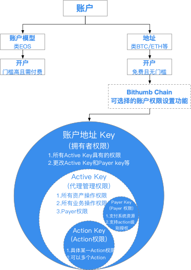
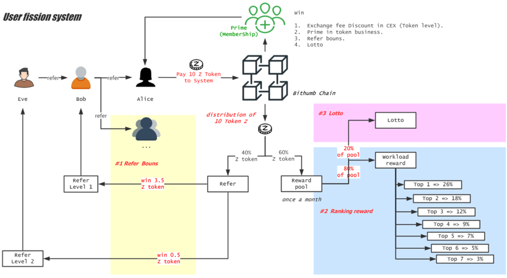

************************
Bithumb Chain介绍
************************

============
白皮书
============

- `中文白皮书 <https://bithumb.network/wp/BithumbChain-WhitePaper-Cn.pdf>`_

============
OBFT共识
============
Bithumb Chain采用独创的OBFT（Open Byzantine Fault Tolerance，混合共识模型），以保证出块效率及终局速度。

首先，OBFT的共识参与者是超级节点集群，所有节点均由抵押以及投票排名（DPOS）决定。其次， OBFT中采用了VRF，因此共识规模理论上可以无限大。接下来我们来说明一下OBFT混合共识的运行流程。

第一阶段

采用VRF算法在所有的超级节点中随机产生出块节点，在上一个出块人被确定以后，下一个出块人才会被确定，并且在这之前是不可预测的。每一个区块都有一主多备的出块节点，备选节点在监测到主节点停止工作时会代替主节点发起共识。一主多备的机制是为了保证网络的容错率以及出块效率，我们也称这个阶段为Flood。

第二阶段

采用类BFT的共识算法，目的为快速终局，并且是批量终局。BFT投票机制在区块链系统中相对于其他系统有一个很大的特点或优势，我们可以乐观的认为绝大部分的共识消息都会是YES， 因此在BFT共识中，可以一次确认一批区块，而不再需要一个一个区块去达成BFT共识。传统共识方法中，通信开销非常大，网络不确定性等因素会带来很大影响。批量共识可以使共识的通信频次呈几何倍数降低，以少量的网络交互，就可以实现大批量的业务处理。

另外一方面，得益于我们对一阶段和二阶段的解耦，一阶段可以在二阶段出现诸如卡顿的情况下，依然维持正常出块。而二阶段在恢复正常后，以批量共识可以迅速追赶一阶段的出块进度。因此，网络的稳定性以及出块效率得以兼顾。

================================================
资源模型与Defi应用
================================================
1.资源模型概要

目前绝大多数的公链项目为了防止系统资源滥用, 用户发送交易都需要支付一部分代币做为交易的手续费，但是这种收费模型对于具有小额高频交易需求的用户显然很不友好。

Bithumb Chain将区块链网络抽象成区块链操作系统，引入了许多计算机结构体系的概念。用户在Bithumb Chain发送交易，不需要支付交易手续费，但是需要系统资源。系统资源按照获取和计费方式，主要分为两类。

网络带宽资源(NET)以及CPU计算资源(CPU)，用户发送交易到节点，节点需要将交易广播给区块生产者，这个过程需要消耗网络带宽资源。针对这笔交易，节点运行合约代码需要消耗CPU算力，因此需要CPU计算资源。

存储资源(RAM)，交易执行成功以后，需要存储一些状态数据，比如交易订单或者账户余额等等，这些就需要存储资源。

2.如何获取系统资源

NET和CPU，通过抵押代币到系统，用户能够获取到用户抵押量占全网总抵押量等比例的系统资源。这个过程不会产生任何费用，用户可以取消抵押来收回抵押到系统的代币，在取消抵押后，用户的资源也会被收回。

RAM，不同与NET、CPU抵押的方式，RAM采用的是交易制，用户可以向系统购买RAM，也可以将持有的RAM卖给系统。买卖的价格取决于全网RAM的供需关系。

3.资源计费方式

单笔交易花费的NET为交易大小，也就是交易对应的字节数，CPU的花费为执行合约消耗的计算时间。NET和CPU都是瞬时使用需求，因此，交易所消耗的NET、CPU资源会在24小时内逐步返还。

如果交易产生了新的存储，则会消耗对应字节数的RAM。消耗的RAM在业务数据被删除时，存储会被释放。

4.Defi应用-资源租赁平台

了解关于Bithumb Chain资源模型的相关内容以后，我们可以发现，用户的NET、CPU的使用量和用户抵押到系统的代币是成正比的，但是对于有大量资源使用需求但是持有代币较少的用户来说，在当前的资源模型下，很难满足这类用户的要求。反之，对于持有代币较多但是无资源使用需求的用户，抵押进系统的代币也没有得到收益。为了解决上述问题，我们推出了资源租赁平台。

- 房东(landlord)，代币持有者将代币抵押到租赁平台，成为房东。抵押有一定的锁仓期，在结束锁仓后，用户可以随时将抵押的代币赎回，同时还能获得成为房东期间的收益。收益来源包括租金、购买RAM的手续费以及其他链上应用的收益。

- 租客(tenant)，资源使用者可以通过像租赁平台支付一定的租金，租赁到更多的资源，满足使用需求。

================
Payer
================
从技术的角度上来讲，NET/CPU/RAM的设计是一种很好的设计，但也让用户的学习成本变高了，会极大的损害用户的参与意愿。

因此Bithumb Chain增加了一个Payer的设计，Payer的定义为提供交易运行在Bithumb Chain系统所需资源的专业服务提供者，他为用户代付，而用户可能以某种形式支付了报酬，也可能是Payer和用户在线下协商达成了协定。

可能是因为投票而提供的免费服务，可能是某种价值支付关系，例如法币，BT，或者他自己发行的货币，也可能是包月服务等等。

而在链上，为了支持Payer的专业化发展，对资源的staking，我们增加了时长因素，对超过某一个时长的staking，可以在资源的竞争中更有优势。

=============================
基于公钥的权限体系
=============================
传统的公私钥权限体系，权限的最小粒度是公钥，公钥生成地址，表示账户，一个账户只有一个实际控制人，谁掌握着私钥谁就有所有权限。实际难以满足风险控制和一部分业务目标的需求。例如一个企业申请一个账号，实际使用过程中显然无法满足流程化权限控制的业务需求，单一地址频繁的私钥操作也存在私钥泄露风险。

为了方便用户免费且无门槛使用，同时兼顾可选择的账户权限设置需求。综合考虑后，Bithumb Chain打造了一个全新的基于公钥的权限体系。Bithumb Chain账户是整个系统的最小单位，账户权限由私钥控制，与其他公私钥体系的区块链系统如BTC/ETH相同。

不同的是Bithumb Chain额外允许账户所有者基于业务及级别指定自己的业务代理账户，不仅可以更好得设计业务权限和管理风险，还可以允许原账户在业务操作账户丢失等场景下，通过重置业务代理账户，回收相应权限。具体如下：

1. 权限级别设置

每个账户都有两个默认权限级别，包括active和payer。

- active 权限涵盖除权限设置以外的所有操作权限，例如转账、为节点投票、购买域名、payer权限等；

- payer 权限仅用来支付系统资源（Net/Cpu）。

2. 自定义业务代理设置

- 账户还可以为单个action设置权限，以便账户的扩展性管理。action指某本合约的某个具体操作，比如转账。

- Payer权限也支持action级别授权。比如transfer的payer权限。

最后，我们建议权限设置账户所有者在设置好权限之后，将私钥放入冷钱包储存，此权限可以重置其他权限并拥有所有操作权限。

图一：Bithumb Chain基于公钥的权限体系

================
VDNS系统
================
在现实世界中，标识一个人通常会用身份证、护照等。在区块链体系中，则是一个地址，该地址背后的人/物品通常是不会变的，这样就实现了区块链体系对现实世界实体的标识和锚定。

但是，区块链中的地址很复杂。以比特币为例，其地址是公钥经过哈希运算和编码后的34字节长的数（16进制），例如：1FsbKR6UpV6GW8o8szccdxXkquzTg2VZLL。
这非常难以记忆！

同时，这种简单的数字地址无法反映背后复杂的社会关系，例如日常生活中，用户A基于自己的身份证，可以在银行开设账户A，并在该账户内开设一个子账户A1，也可以注销一个子账户A2。或者A可以使用身份证在某银行开设ABank账户，同时在某证券公司开设Asecurity账户，对于一般大众来说，这是很自然的事情，但是在区块链体系内却无法支持。

因此，参考信息互联网体系内的域名（Domain Name）系统，Bithumb Chain提出了VDNS(ValueNet Domain Name System)。使用字符型标识代替长数字串地址，同时支持多级域名，以方便迅速确认信任关系，横向打通多种场景。

Bithumb Chain中，一个地址可以拥有多个域名，域名最长为32位。域名的第1级是顶级域名，先到先得，顶级域名可以在二级市场中自由流通。顶级域名可以开启次级域名，最长为5级。域名可以开设给任何地址作为别名，例如个人/组织/合约/IoT设备等。因此，从属或背书关系可以很方便的通过域名的层级关系来表达，比方说，1级域名就有对名下所有级别域名的拉黑权限，同时也要对下级域名的注册等背书。
VDNS中的域名分为不同的类型：

- 12位小写字母或数字1-9组成的域名为“普通域名或者免费域名”，每个地址可免费注册一个。

- 以“system”为后缀的是“系统域名”，仅Bithumb Chain原生合约由才有资格拥有。

- 以“bithumb”为后缀的是“官方域名”，由基金会合约分配。

- 以 “com”, “cn”等为后缀的是“保留域名”，目前无实际用途，仅做保留。 "com", "cn", "net", "org", "io", "one", "global", "us", "co", "edu", "star", "dex", "system", "spbithumb ", "bithumbsp", "dapp", "app", "prime"

- 3位到11位长度的所有合法一级域名，均为“可购买域名”，通过购买获得。

一些敏感场景对隐私性具有较高需求，域名系统对此进行了相关的功能延拓。以非公开证明为例，证明颁发者可以在链下为用户颁发证明（背书），用户链下提供证明给相关验证者，而验证者可以通过VDNS追溯证明颁发者地址所持有的域名，以确认是否符合本地验证要求来确认有效性。这样，就同时满足了背书认证和传输的隐私性要求。

===============================
用户裂变
===============================
对于网络中的产品来说，只有连接数量达到“临界点”，才会产生出强大的网络效应。不论是项目孵化、价值扩张、价值协同，还是构建PLEX（非许可型交易所）、完成Bithumb Family生态互联互通、打造新一代价值生态体系等，都需要规模足够大的网络。

目前区块链技术还未实现大规模应用，相较其它手段，用户裂变在扩展网络规模方面更为有效。Bithumb Chain内置了一个通用的用户裂变工具，加入Bithumb Chain就可以使用。

Bithumb Chain支持两级用户裂变，每级裂变的用户数量不设上限。以游戏类项目举例，GameZ定义了自己的会员优先权体系，并且把会员的发行权交给了Bithumb Chain 上的Prime合约，设定若要成为GameZ的Prime资格需要支付10个Z通证，用户向合约完成支付并且指定一个推荐人，就可以参与到裂变中来（如果不指定推荐人，需要支付30个通证）。具体机制见下图：

图二：Bithumb Chain用户裂变机制

 
另外，这些Prime资格也可以被Bithumb Family的机构认可，例如在Bithumb Family交易所内，该币种关联的交易手续费可以打折，横向打通不同产品，形成流量互导，共享共建的生态体系。

Z通证具体分配：

- 推荐奖励

用户每介绍一个用户可以获得3.5个通证，而上级推荐人也可以同时获得0.5个通证，剩余的则计入大奖池。

- 月度“裂变之星”

按照当月裂变收入的排名，对前7名进行奖励，总共获得大奖池该月奖励额的80%。具体发放比例见上图。

- 月度“幸运之星”

每月随机奖励1人，奖励额为大奖池该月总收入的20%，全体具有优先权的用户可以参与抽奖。抽奖规则为：按照当月最后一个区块的VRF作为随机数，距离随机数最近的公钥产生中奖用户。

===============================
新型的非许可行交易协议
===============================
Coming soon......
